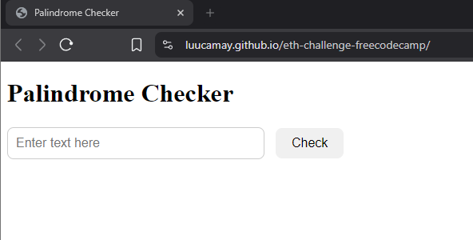

# Palindrome Checker WebApp

# 🧠 Palindrome Checker

A simple web app that checks if a word or phrase is a **palindrome** — a string that reads the same backward as forward, ignoring punctuation, spaces, and letter case.

## 🚀 Features

- Checks palindromes in real-time.
- Ignores special characters, spaces, and case.
- Shows the result dynamically below the input.
- Alerts the user if no input is entered.
- Clean, responsive design.

## 📸 Preview

 <!-- Optional: Add a screenshot image here -->

## 🛠️ Technologies Used

- HTML5
- CSS3
- JavaScript (Vanilla)

## 📁 File Structure

palindrome-checker/
├── index.html # Main HTML structure
├── script.js # JavaScript logic for checking palindrome
├── styles.css # External stylesheet for styling the app
└── README.md # This file

## 🔧 How to Run It

1. Clone or download the repository.
2. Open `index.html` in your browser.
3. Type a word or phrase into the input field.
4. Click the **Check** button to see if it's a palindrome.

## ✨ Examples

"A" → A is a palindrome.
"eye" → eye is a palindrome.
"race car" → race car is a palindrome.
"not a palindrome" → not a palindrome is not a palindrome.
"A man, a plan, a canal. Panama" → A man, a plan, a canal. Panama is a palindrome.

## 📬 Feedback

If you find any bugs or have suggestions, feel free to open an issue or fork the project and contribute!

## 📄 License

This project is open-source and available under the [MIT License](LICENSE).

---

Happy coding! ❤️
